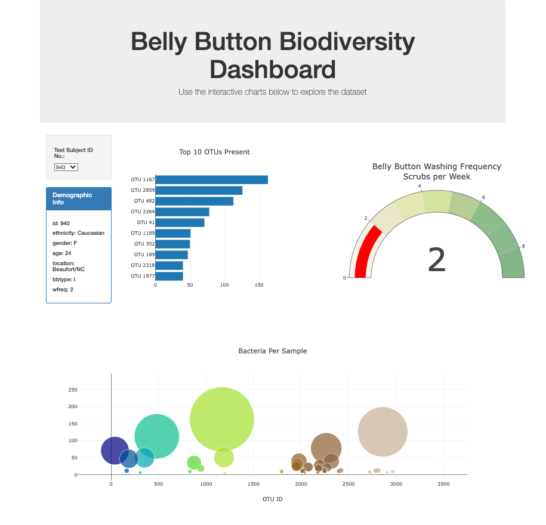

# Module 14 Challenge

## 
Background / Scenario
 

In this assignment, you will build an interactive dashboard to explore the [Belly Button Biodiversity](https://robdunnlab.com/projects/belly-button-biodiversity/) dataset, which catalogs the microbes that colonize human navels.

The dataset reveals that a small handful of microbial species (also called operational taxonomic units, or OTUs, in the study) were present in more than 70% of people, while the rest were relatively rare.
 

## 
Dashboard Deliverable
 

<ins>Screenshot of Interactive Dashboard</ins>:   

 

### 
DASHBOARD FEATURES
 

- Use the D3 library to read in samples.json from the URL https://2u-data-curriculum-team.s3.amazonaws.com/dataviz-classroom/v1.1/14-Interactive-Web-Visualizations/02-Homework/samples.json.
- Create a horizontal bar chart with a dropdown menu to display the top 10 OTUs found in that individual.
- Create a bubble chart that displays each sample.
- Display the sample metadata, i.e., an individual's demographic information.
- Display each key-value pair from the metadata JSON object somewhere on the page.
- Update all the plots when a new sample is selected.
- Deploy your app to a free static page hosting service, such as GitHub Pages. 
 

## 
References

Hulcr, J. et al. (2012) A Jungle in There: Bacteria in Belly Buttons are Highly Diverse, but Predictable. Retrieved from: http://robdunnlab.com/projects/belly-button-biodiversity/results-and-data/.
 
 
 
       